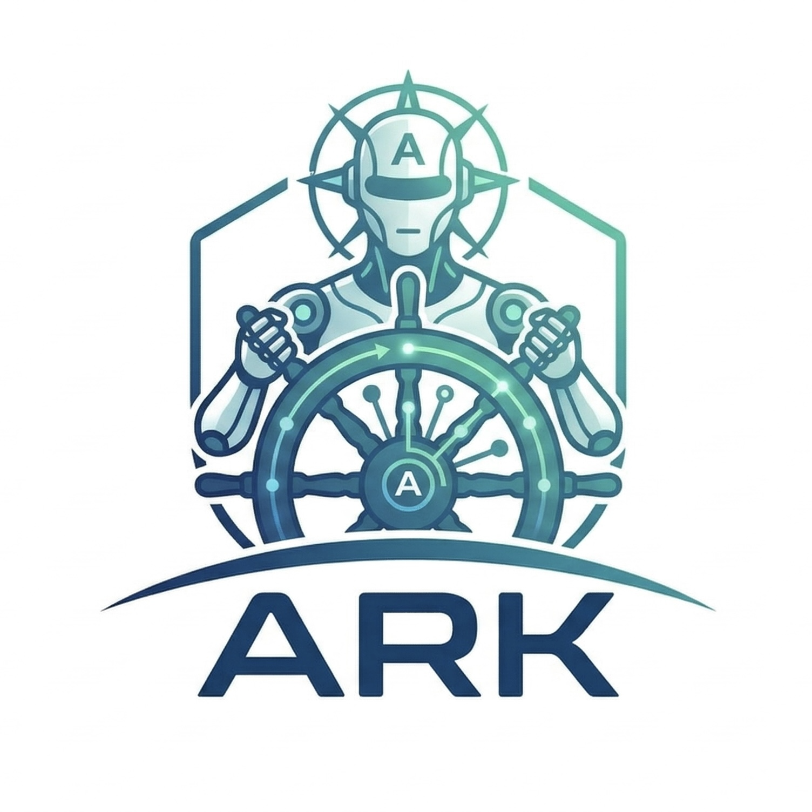
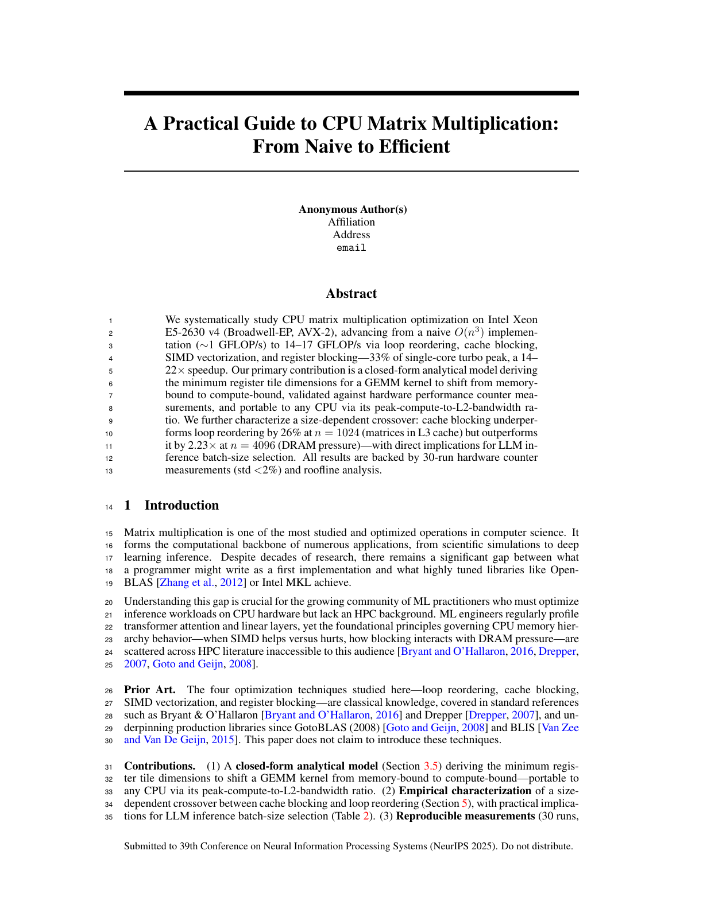
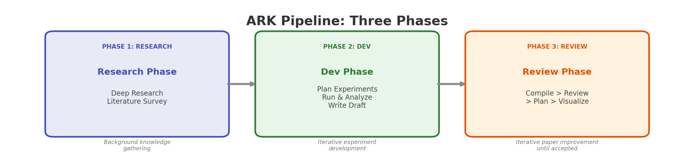
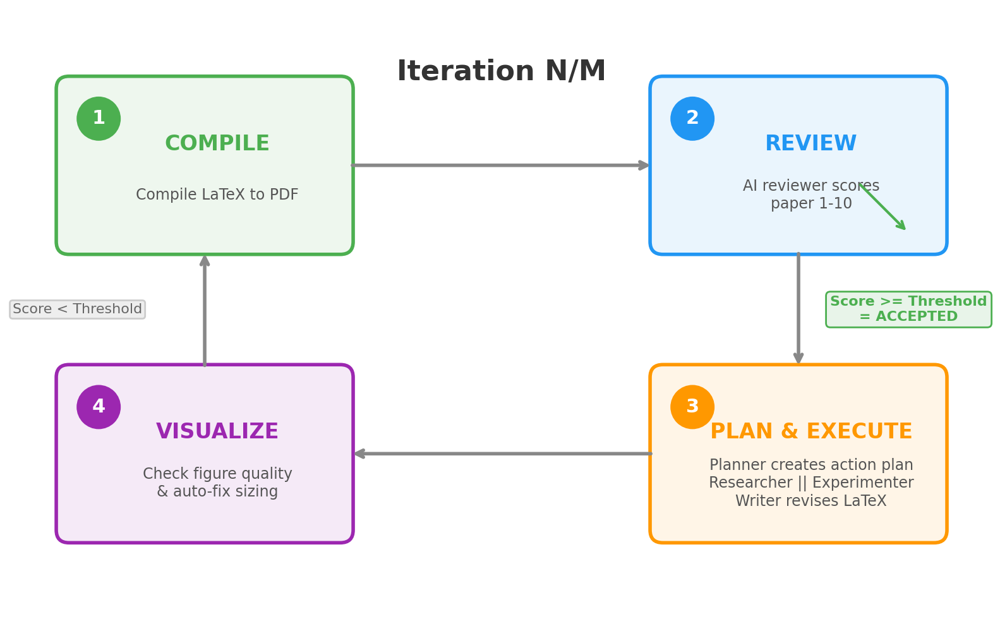

<p align="center">
  <strong>English</strong> &bull; <a href="README_zh.md">中文</a> &bull; <a href="README_ar.md">العربية</a>
</p>

<p align="center">
  
</p>

<h1 align="center">ARK: Automatic Research Kit</h1>

<p align="center">
  <strong>From research idea to camera-ready paper — fully autonomous</strong>
</p>

<p align="center">
  
  
  <a href="https://github.com/kaust-ark/ARK/actions/workflows/ci.yml"></a>
  
  
</p>

<p align="center">
  <a href="https://kaust-ark.github.io/ARK/"><strong>Website</strong></a> &bull;
  <a href="#quick-start">Quick Start</a> &bull;
  <a href="#how-it-works">How It Works</a> &bull;
  <a href="#cli-reference">CLI</a> &bull;
  <a href="docs/architecture.md">Architecture</a> &bull;
  <a href="docs/configuration.md">Configuration</a>
</p>

---

ARK orchestrates 8 specialized AI agents to **plan experiments, write code, run benchmarks, draft LaTeX papers, and iteratively revise** them through automated peer review — until the paper reaches publication quality.

Give it a research idea and a target venue. ARK handles the rest.

## Papers Written by ARK

<table>
<tr>
<td align="center" width="50%">

<br>
<a href="https://github.com/JihaoXin/mma"><em>CPU Matrix Multiplication: From Naive to Efficient</em></a>
<br>
<sub>NeurIPS format &bull; 6 pages &bull; 14 iterations</sub>
</td>
<td align="center" width="50%">

<br>
<a href="https://github.com/JihaoXin/safeclaw"><em>Defenses Against Malicious Agents on OpenClaw</em></a>
<br>
<sub>NeurIPS format &bull; 10 pages &bull; autonomous from proposal PDF</sub>
</td>
</tr>
</table>

## Key Features

| | Feature | Details |
|---|---------|---------|
| **8 Agents** | Reviewer, Planner, Experimenter, Writer, Researcher, Visualizer, Meta-Debugger, Coder | Each with specialized prompts per project |
| **3 Phases** | Research &rarr; Dev &rarr; Review | Background survey, experiments, iterative paper improvement |
| **Claude Code** | Powered by [Claude Code](https://docs.anthropic.com/en/docs/claude-code) | Max subscription recommended — very token-intensive |
| **11+ Venues** | NeurIPS, ICML, ICLR, AAAI, ACL, IEEE, ACM, LNCS... | Auto-configured geometry & figure sizing |
| **Telegram Bot** | Real-time monitoring & intervention | Proactive confirmations at key decisions |
| **Compute** | Slurm &bull; Local &bull; AWS &bull; GCP &bull; Azure | Run experiments anywhere |
| **Deep Research** | Gemini Deep Research integration | Literature survey before writing starts |
| **Nano Banana** | AI figure generation | Concept diagrams via Gemini image models |
| **Smart Recovery** | Checkpoint/resume &bull; meta-debug &bull; self-repair | Handles LaTeX errors, experiment failures |
| **Cost Tracking** | Per-iteration and cumulative reports | Know exactly what each iteration costs |

## How It Works

ARK runs three phases in sequence:

<p align="center">
  
</p>

| Phase | What happens |
|-------|-------------|
| **Research** | Deep Research (Gemini) gathers background knowledge and literature survey |
| **Dev** | Iterative experiment cycle: plan experiments &rarr; run &rarr; analyze results &rarr; evaluate completeness &rarr; write initial draft |
| **Review** | Iterative paper improvement loop until the reviewer score hits the acceptance threshold |

### Review Phase Steps

Each Review Phase iteration runs through 4 steps:

<p align="center">
  
</p>

| Step | What happens |
|------|-------------|
| **1. Compile** | Build LaTeX &rarr; PDF, count pages, extract page images |
| **2. Review** | AI reviewer scores the paper (1&ndash;10), identifies Major & Minor issues |
| **3. Plan & Execute** | Planner creates action plan; researcher and experimenter run in parallel; writer revises LaTeX |
| **4. Visualize** | Check figure dimensions against venue spec, auto-fix sizing, recompile |

The loop repeats until the score reaches the acceptance threshold &mdash; or you intervene via Telegram.

### Architecture

<p align="center">
  
</p>

<p align="center">
  <a href="docs/architecture.md">Full architecture docs &rarr;</a>
</p>

## Quick Start

First, create and activate a Python virtual environment using your preferred tool (conda, uv, venv, etc.).

```bash
# 1. Install
pip install -e .

# 2. Create a project (interactive wizard)
ark new mma                    # e.g. "CPU Matrix Multiplication" paper

# 3. Run — ARK takes it from here
ark run mma                    # starts Research → Dev → Review loop

# 4. Watch it work
ark monitor mma                # live dashboard: agents, score trend

# 5. Check progress
ark status mma                 # score: 7.2/10, iteration: 5, phase: Review
```

The wizard walks you through: code directory, venue, research idea, authors, compute backend, figure generation, and Telegram setup.

### Start from an Existing PDF

```bash
# Extract title, authors, and research plan from a proposal/draft
ark new mma --from-pdf proposal.pdf
```

ARK parses the PDF with PyMuPDF + Claude Haiku, pre-fills the wizard, and can kick off a full paper or dev project from the extracted spec.

## CLI Reference

| Command | What it does |
|---------|-------------|
| `ark new <name>` | Create project via interactive wizard |
| `ark run <name>` | Launch the autonomous loop |
| `ark status [name]` | Score, iteration, phase, cost (or list all projects) |
| `ark monitor <name>` | Live dashboard with agent activity, score trend |
| `ark update <name>` | Inject a mid-run instruction |
| `ark stop <name>` | Gracefully stop |
| `ark restart <name>` | Stop + restart |
| `ark research <name>` | Run Gemini Deep Research standalone |
| `ark config <name> [key] [val]` | View or edit config |
| `ark clear <name>` | Reset state for a fresh start |
| `ark delete <name>` | Remove project entirely |
| `ark setup-bot` | Configure Telegram bot (one-time) |
| `ark list` | List all projects with status |
| `ark webapp install` | Install prod web portal service (port 8423) |
| `ark webapp install --dev` | Install dev web portal service (port 8424) |
| `ark webapp uninstall` | Stop and remove prod service |
| `ark webapp release` | Tag and deploy current code to prod |

> **Note:** `ark webapp --daemon` is deprecated and will be removed in a future release. Use `ark webapp install` instead.

<details>
<summary><strong>Web Portal (dev/prod)</strong></summary>

ARK has two webapp environments with separate databases:

| | Prod | Dev |
|--|------|-----|
| URL | `http://mcmgt01:8423` | `http://mcmgt01:8424` |
| Service | `ark-webapp` | `ark-webapp-dev` |
| DB | `ark_webapp/webapp.db` | `ark_webapp/webapp-dev.db` |
| Code | `~/.ark/prod/` (pinned to git tag) | Current repo (live) |

```bash
# First-time setup
ark webapp release              # create prod from current code (tags v0.1.0)
ark webapp install              # start prod service (port 8423)
ark webapp install --dev        # start dev service (port 8424)

# Deploy new changes to prod
ark webapp release              # tag, update prod worktree, restart service

# Custom version tag
ark webapp release --tag v1.0.0
```

Dev reflects code changes immediately. Prod only updates on `ark webapp release`.

</details>

<details>
<summary><strong>Direct orchestrator invocation</strong></summary>

```bash
# Paper mode, max 20 iterations
python -m ark.orchestrator --project mma --mode paper --max-iterations 20

# Dev mode (software development, not paper writing)
python -m ark.orchestrator --project mma --mode dev

# Background
nohup python -m ark.orchestrator --project mma --mode paper \
  > auto_research/logs/orchestrator.log 2>&1 &
```

</details>

## Telegram Integration

### Setup

1. Open Telegram, message [@BotFather](https://t.me/BotFather), send `/newbot`, and follow prompts to get a **Bot Token**
2. Run the setup wizard:
   ```bash
   ark setup-bot
   ```
3. Paste your Bot Token when prompted
4. Send any message to your new bot in Telegram, then press Enter
5. ARK auto-detects your Chat ID and sends a test message

Credentials are saved to `~/.ark/telegram.yaml` and shared by all projects.

### What you get

- **Live notifications** — score changes, phase transitions, errors
- **Send instructions** — text a message to steer the current iteration
- **Request PDFs** — get the latest compiled paper sent to you
- **Proactive confirmations** — ARK asks before starting Deep Research or when it needs a LaTeX template URL
- **Persistent daemon** — keeps responding even when the orchestrator is stopped

## Requirements

- **Python 3.9+** with `pyyaml` and `PyMuPDF`
- [**Claude Code**](https://docs.anthropic.com/en/docs/claude-code) CLI installed and authenticated
- **Claude Max subscription strongly recommended** — ARK is extremely token-intensive (each iteration invokes multiple agents)
- Optional: LaTeX (`pdflatex` + `bibtex`), Slurm, `google-genai` for AI figures

```bash
pip install -e .                    # Core (PyMuPDF included)
pip install -e ".[research]"       # + Gemini Deep Research & Nano Banana
```

## More

- [Architecture & Module Reference](docs/architecture.md)
- [Configuration, Venues & Compute Backends](docs/configuration.md)
- [Testing (84 tests)](docs/testing.md)

## Roadmap & Known Issues

See [TODO.md](TODO.md) for the full list. Highlights:

- **Domain skill integration** — integrate [claude-scientific-skills](https://github.com/K-Dense-AI/claude-scientific-skills) (170+ skills for biology, chemistry, physics, geospatial, finance, etc.) to support non-CS researchers
- **Backend parity** — Codex and Gemini backends lack full feature parity with Claude Code
- **Cloud compute verification** — AWS/GCP/Azure compute backends exist but are not yet end-to-end validated
- **Edge & custom environments** — support air-gapped HPC, Jetson, limited-connectivity labs
- **Figure layout quality** — column overflow, font size mismatch, subplot alignment issues
- **Citation authenticity** — LLM-generated references can be hallucinated; need post-write verification against Semantic Scholar / CrossRef
- **Integration testing** — no end-to-end pipeline test yet

## License

[Apache 2.0](LICENSE)
