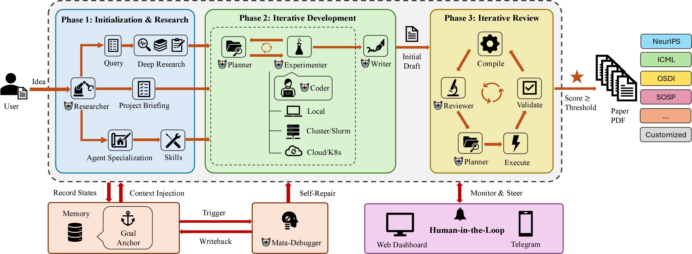

<p align="center">
  <a href="README.md">English</a> &bull; <a href="README_zh.md">中文</a> &bull; <strong>العربية</strong>
</p>

<p align="center">
  
</p>

<h1 align="center">idea2paper</h1>

<p align="center">
  <em>خفف العبء. وجّه العلم.</em>
</p>

<p align="center">
  
  
  <a href="https://github.com/kaust-ark/ARK/actions/workflows/ci.yml"></a>
  
  
</p>

<p align="center">
  <a href="https://idea2paper.org/"><strong>الموقع الإلكتروني</strong></a> &bull;
  <a href="#بداية-سريعة">بداية سريعة</a> &bull;
  <a href="#المتطلبات">المتطلبات</a> &bull;
  <a href="#مسار-العمل">مسار العمل</a> &bull;
  <a href="#الوكلاء">الوكلاء</a> &bull;
  <a href="#الحوسبة-السحابية">السحابة</a> &bull;
  <a href="#مرجع-cli">واجهة الأوامر</a>
</p>

---

يقوم نظام idea2paper بتنسيق عمل **6 وكلاء ذكاء اصطناعي متخصصين** لتحويل فكرة بحثية إلى ورقة علمية كاملة &mdash; من تحليل المقترح، والبحث في المراجع، وتجارب Slurm، وصولاً إلى صياغة LaTeX والمراجعة العلمية المتكررة &mdash; كل ذلك مع بقائك في موقع التحكم عبر **واجهة الأوامر (CLI)**، أو **لوحة التحكم**، أو **تيليجرام**.

```
أعطه فكرة ومؤتمراً علمياً. وسيتولى idea2paper الباقي.
```

## أوراق بحثية كتبها idea2paper

<table align="center">
<tr>
<td align="center" width="33%">
<a href="https://idea2paper.org/assets/papers/marco.pdf"></a>
<br>
<strong>Budget-Constrained Multi-Modal Research Synthesis via Iterative-Deepening Agentic Search</strong>
<br>
<sub>القالب: EuroMLSys</sub>
</td>
<td align="center" width="33%">
<a href="https://idea2paper.org/assets/papers/heteroserve.pdf"></a>
<br>
<strong>HeteroServe: Capability-Weighted Batch Scheduling for Heterogeneous GPU Clusters in LLM Inference</strong>
<br>
<sub>القالب: ICML</sub>
</td>
<td align="center" width="33%">
<a href="https://idea2paper.org/assets/papers/tierkv.pdf"></a>
<br>
<strong>TierKV: Prefetch-Aware Memory Tiering for KV Cache in LLM Serving</strong>
<br>
<sub>القالب: NeurIPS</sub>
</td>
</tr>
</table>

---

## بداية سريعة

```bash
curl -fsSL https://idea2paper.org/install.sh | bash
```

السكربت سيقوم بـ:

1. كشف النظام، تثبيت miniforge عند الحاجة، إنشاء بيئتي `ark-base` و `ark`، تثبيت idea2paper بصيغة `pip install -e` داخل `~/ARK`، وتثبيت أدوات Claude Code + Gemini CLI.
2. سؤالك عن: **مفتاح Gemini API**، **رمز Claude OAuth** (`sk-ant-oat01-…` تحصل عليه من `claude /login`)، و**البريد الإلكتروني لتسجيل الدخول إلى لوحة التحكم**. اضغط Enter لتخطّي أي حقل.
3. تثبيت لوحة التحكم كخدمة `systemd --user` على المنفذ `9527` (استخدم `--no-webapp` للتخطّي).
4. طباعة **رابط سحري لمرة واحدة** للبريد المُدخل — انقر عليه مرة واحدة وستدخل لوحة التحكم المحلية. لا حاجة لـ SMTP أو Google OAuth.

بعد ذلك، لوحة التحكم على <http://localhost:9527> هي واجهة العمل الرئيسية — إنشاء المشاريع، اختيار النموذج، التشغيل، والمراقبة. سطر الأوامر يعمل كذلك:

```bash
ark doctor          # التحقّق من التثبيت
ark new myproject   # معالج إنشاء المشروع
ark run  myproject
ark monitor myproject
```

شغّل `ark webapp login <email>` في أي وقت للحصول على رابط دخول جديد. خيارات السكربت الكاملة: [`website/homepage/install.sh --help`](website/homepage/install.sh).

### البدء من ملف PDF موجود

```bash
ark new myproject --from-pdf proposal.pdf
```

يقوم idea2paper بتحليل ملف PDF باستخدام PyMuPDF + Claude Haiku، ويملأ البيانات تلقائياً، ويبدأ من المواصفات المستخرجة.

---

## المتطلبات

- **Python 3.10+** مع `pyyaml` و `PyMuPDF`
- **واجهة أوامر الوكيل**: [Claude Code](https://docs.anthropic.com/en/docs/claude-code) (موصى به، باقة Claude Max)، [OpenAI Codex](https://github.com/openai/codex)، **أو** [Gemini CLI](https://github.com/google-gemini/gemini-cli) &mdash; قابل للاختيار لكل مشروع.
- **اختياري**: LaTeX (`pdflatex` + `bibtex`)، Slurm، `google-genai` للأشكال البيانية المولدة بالذكاء الاصطناعي.

### التثبيت

أسرع طريقة هي السكربت ذو الأمر الواحد المذكور في [بداية سريعة](#بداية-سريعة)، فهو يقوم بهذه الخطوات نيابة عنك. للتنفيذ اليدوي:

```bash
# 1. أنشئ قالب بيئة المشاريع (المكدّس البحثي فقط، بدون كود idea2paper —
#    كل مشروع جديد يستنسخ هذه البيئة، لذلك يجب أن تبقى نظيفة).
conda env create -f environment.yml         # لأنظمة Linux (ينشئ "ark-base")
# أو لنظام macOS:
conda env create -f environment-macos.yml   # لأنظمة macOS (ينشئ "ark-base")

# 2. ثبّت idea2paper نفسه في بيئة منفصلة (ليست ark-base).
conda create -n ark python=3.11 -y
conda activate ark
pip install -e .                    # النواة الأساسية
pip install -e ".[research]"       # + Gemini Deep Research و Nano Banana
pip install -e ".[webapp]"         # + دعم لوحة التحكم وخدمة systemd

# 3. تحقّق
ark doctor
```

---

## إطار العمل

<p align="center">
  
</p>

ينسق idea2paper ثلاث مراحل &mdash; **التهيئة والبحث**، **التطوير المتكرر**، و **المراجعة المتكررة** &mdash; من خلال ذاكرة مشتركة، و**Goal Anchor** ثابت يُحقن من جديد في كل استدعاء وكيل لمنع الانحراف عبر التكرارات، إضافةً إلى تدخل بشري عبر لوحة التحكم أو تيليجرام.

---

## مسار العمل

ينفذ idea2paper ثلاث مراحل بالتتابع. وتتكرر مرحلة المراجعة حتى تصل الورقة إلى الدرجة المستهدفة.

| المرحلة | ماذا يحدث |
|:------|:-------------|
| **البحث** | مسار من 5 خطوات: الإعداد (بيئة conda) &larr; تحليل المقترح (researcher) &larr; بحث عميق (Gemini) &larr; التخصيص (researcher) &larr; التمهيد (المهارات والاستشهادات) |
| **التطوير** | دورة تجارب متكررة: تخطيط &larr; تشغيل على Slurm &larr; تحليل &larr; كتابة المسودة الأولى |
| **المراجعة** | تجميع &larr; مراجعة &larr; تخطيط &larr; تنفيذ &larr; تحقق، مع التكرار حتى تصل الدرجة &ge; العتبة المطلوبة |

### حلقة المراجعة

كل تكرار لمرحلة المراجعة يتكون من **5 خطوات**:

| الخطوة | الوصف |
|:-----|:------------|
| **التجميع** | تحويل LaTeX إلى PDF، حساب عدد الصفحات، وصور الصفحات |
| **المراجعة** | مراجع ذكاء اصطناعي يعطي درجة من 1-10، ويسرد القضايا الكبرى والصغرى |
| **التخطيط** | المخطط (Planner) ينشئ خطة عمل ذات أولوية |
| **التنفيذ** | الباحث والمجرب يعملان بالتوازي؛ والكاتب يراجع نصوص LaTeX |
| **التحقق** | التأكد من نجاح تجميع التعديلات؛ وإعادة إنشاء ملف PDF |

تتكرر الحلقة حتى تصل الدرجة إلى عتبة القبول &mdash; أو تتدخل أنت عبر تيليجرام.

---

## الوكلاء

| الوكيل | الدور |
|:------|:-----|
| **الباحث** | يحلل المقترح؛ يجري مسحاً أدبياً مدعوماً بـ Gemini؛ ويخصص مطالبات الوكلاء للمشروع |
| **المراجع** | يقيم الورقة وفقاً لمعايير المؤتمر، ويولد مهام التحسين |
| **المخطط** | يحول ملاحظات المراجعة إلى خطة عمل؛ يحلل نتائج مرحلة التطوير |
| **الكاتب** | يصيغ ويحسن أقسام LaTeX مع استشهادات موثقة من DBLP |
| **المجرب** | يصمم التجارب، يرسل وظائف Slurm، ويحلل النتائج |
| **المبرمج** | يكتب ويصحح أكواد التجارب وسكربتات التحليل |

---

## ما الذي يميز idea2paper

| | أدوات أخرى | idea2paper |
|---|:------------|:----|
| **التحكم** | استقلالية كاملة &mdash; انحراف عن القصد، لا تصحيح أثناء التشغيل | تدخل بشري: توقف عند القرارات الرئيسية، توجيه عبر تيليجرام أو الويب |
| **التنسيق** | تخطيطات مكسورة، أخطاء LaTeX، تنظيف يدوي | قوالب المؤتمرات + تحكم دون مستوى الصفحة للالتزام بالحد الأقصى للصفحات بدقة |
| **الاستشهاد** | النماذج اللغوية تبتكر مراجع وهمية | BibTeX من واجهات برمجية أولاً (DBLP / CrossRef / arXiv) مع مواءمة المحتوى مع الادعاء |
| **المراجعة** | مراجعة نصية فقط لمصدر LaTeX | مراجعة بصرية: صور الصفحات **و** المصدر، بتقييم وفق معايير المؤتمر |
| **الأشكال** | أنماط افتراضية، أحجام خاطئة، لا وعي بالصفحة | Nano Banana + قماش واعي بالمكان، عرض الأعمدة، والخطوط |
| **العزل** | بيئة مشتركة &mdash; المشاريع تتداخل مع بعضها | بيئة conda لكل مشروع، HOME معزول، عزل كامل للمستأجرين |
| **النزاهة** | المحاكاة بدلاً من التجارب الحقيقية | مطالبات تمنع المحاكاة + مهارات مدمجة تفرض التنفيذ الحقيقي |

---

## عزل البيئة

يعمل كل مشروع في **بيئة conda خاصة به**، يتم استنساخها من بيئة أساسية عند إنشاء المشروع. وهذا يضمن عزلاً كاملاً:

- **Python معزول** &mdash; دليل `.env/` خاص لكل مشروع مع حزمه الخاصة.
- **HOME معزول** &mdash; يعمل كل منسق مع ضبط `HOME` على دليل المشروع.
- **لا تلوث متبادل** &mdash; تمنع `PYTHONNOUSERSITE=1` تسرب حزم المستخدم العامة.
- **تجهيز تلقائي** &mdash; يكتشف `ark run` وبوابة الويب بيئة المشروع ويستخدمانها؛ ويقوم المسار بتهيئتها إذا كانت مفقودة.

```bash
# يتم إنشاء بيئة conda تلقائياً عند أول تشغيل.
# ark run سيكتشفها ويستخدمها:
ark run myproject
#   Conda env: /path/to/projects/myproject/.env
```

## نظام المهارات

يأتي idea2paper مع **مهارات مدمجة** &mdash; مجموعات تعليمات برمجية يحملها الوكلاء لفرض أفضل الممارسات:

| المهارة | الغرض |
|:------|:--------|
| **نزاهة البحث** | تمنع المحاكاة: يجب على الوكلاء تشغيل تجارب حقيقية |
| **التدخل البشري** | بروتوكول التصعيد: يتوقف الوكلاء للسؤال قبل الإجراءات غير القابلة للتراجع |
| **عزل البيئة** | يفرض حدود البيئة الخاصة بكل مشروع |
| **صندوق وقت التشغيل** | يقيّد كل مشروع وقت التشغيل ببيئة conda الخاصة به و`HOME` ودليل مؤقت خاص |
| **نزاهة الأشكال البيانية** | يتحقق من مطابقة الأشكال للبيانات؛ يمنع الرسوم الوهمية |
| **تعديل الصفحات** | يحافظ على حدود عدد الصفحات عبر تعديل كثافة المحتوى |

تعيش المهارات المدمجة في `skills/builtin/` ويتم تثبيتها تلقائياً أثناء تهيئة المسار. وتقع مهارات المجالات (مثل HPC) في `skills/library/`، ويختارها الباحث عند الحاجة.

---

## مرجع CLI

| الأمر | الوصف |
|:--------|:------------|
| `ark new <name>` | إنشاء مشروع عبر معالج تفاعلي |
| `ark run <name>` | إطلاق مسار العمل (يكتشف بيئة المشروع تلقائياً) |
| `ark status [name]` | الدرجة، التكرار، المرحلة، التكلفة |
| `ark monitor <name>` | لوحة مراقبة حية: نشاط الوكلاء، اتجاه الدرجة |
| `ark update <name>` | حقن تعليمات أثناء التشغيل |
| `ark stop <name>` | إيقاف هادئ |
| `ark restart <name>` | إيقاف + إعادة تشغيل |
| `ark research <name>` | تشغيل Gemini Deep Research بشكل مستقل |
| `ark config <name> [key] [val]` | عرض أو تحرير الإعدادات |
| `ark clear <name>` | إعادة ضبط الحالة لبداية جديدة |
| `ark delete <name>` | حذف المشروع تماماً |
| `ark setup-bot` | إعداد بوت تيليجرام |
| `ark list` | سرد جميع المشاريع مع حالتها |
| `ark doctor` | تشخيص التثبيت الذاتي (البيئات، مفاتيح API، الويب) |
| `ark cite-check <name>` | التحقق من استشهادات المشروع عبر DBLP / CrossRef |
| `ark cite-search <query>` | البحث في قواعد البيانات الأكاديمية |
| `ark webapp install` | تثبيت خدمة لوحة التحكم |
| `ark access {list,add,remove,add-domain,remove-domain}` | إدارة قائمة Cloudflare Access الخاصة بلوحة التحكم |

---

## لوحة التحكم (Dashboard)

يتضمن idea2paper لوحة تحكم قائمة على الويب لإدارة المشاريع وتوجيه الوكلاء. تعرض اللوحة **شارات المراحل الحية** (Research / Dev / Review)، وتتبع التكاليف في الوقت الفعلي. تدار الخدمة عبر عملية FastAPI واحدة &mdash; منفذ واحد، وحدة systemd واحدة.

### الإعدادات

يُضبط الإعداد عبر `.ark/webapp.env` (يُنشأ تلقائياً عند أول تشغيل لـ `ark webapp`). اضبط `SMTP_*` لتفعيل تسجيل الدخول عبر الرابط السحري، واستخدم `ALLOWED_EMAILS` / `EMAIL_DOMAINS` لتقييد الوصول، واختيارياً `GOOGLE_CLIENT_ID` / `GOOGLE_CLIENT_SECRET` لتفعيل Google OAuth.

### أوامر الإدارة

| الأمر | الوصف |
|:--------|:------------|
| `ark webapp` | بدء لوحة التحكم في المقدمة (مفيد للتصحيح). |
| `ark webapp release` | وسم الكود الحالي ونشره في بيئة الإنتاج. |
| `ark webapp install [--dev]` | تثبيت والبدء كخدمة `systemd` للمستخدم. |
| `ark webapp status` | عرض حالة خدمة systemd. |
| `ark webapp restart` | إعادة تشغيل خدمة لوحة التحكم. |
| `ark webapp logs [-f]` | عرض أو تتبع سجلات الخدمة. |

<details>
<summary><strong>تفاصيل الخدمة (الإنتاج vs التطوير)</strong></summary>

| | الإنتاج | التطوير |
|---|:-----|:----|
| **المنفذ** | 9527 | 1027 |
| **اسم الخدمة** | `ark-webapp` | `ark-webapp-dev` |
| **بيئة Conda** | `ark-prod` | `ark-dev` |
| **مصدر الكود** | `~/.ark/prod/` (مثبت) | المستودع الحالي (مباشر) |

</details>

### النشر الجماعي (prod مشترك)

يمكن للفريق تشغيل نسخة إنتاج واحدة من مجلد مشترك قابل للكتابة من قبل المجموعة، بينما يطوّر كل عضو في نسخته الخاصة وينشر بأمر واحد. في ملف shell rc لكل عضو:

```bash
export ARK_RELEASE_ROOT=/shared/path/ARK    # النسخة المشتركة: prod worktree وقاعدة البيانات والمشاريع
export ARK_CONDA_ROOT=/shared/path/conda    # conda المشترك (بيئتا ark-prod / ark-base)
export ARK_TOOLS_BIN=/shared/path/tools/bin # OpenHands CLI المشترك
umask 002                                   # إبقاء الملفات الجديدة قابلة للكتابة من المجموعة
```

بعد الإعداد، يكفي أن يشغّل **أي عضو** الأمر `ark webapp release` من نسخته: يوسم الإصدار ويدفعه ويحدّث prod worktree المشترك ويثبّت في البيئة المشتركة؛ ثم يلاحظ تطبيق الويب تغيّر علامة `.deployed-tag` ويعيد تشغيل نفسه خلال ~30 ثانية — دون الحاجة لامتلاك الخدمة.

<details>
<summary><strong>الاستدعاء المباشر للمنسق</strong></summary>

```bash
python -m ark.orchestrator --project myproject --mode paper --max-iterations 20
python -m ark.orchestrator --project myproject --mode dev
```

</details>

---

## استخدام Docker

### متطلبات المعمارية

> [!IMPORTANT]
> يعتمد وقت تشغيل idea2paper على مكتبات علمية تكون أكثر استقراراً على x86_64. إذا كنت تستخدم **Apple Silicon (M1/M2/M3)**، يجب عليك البناء لمنصة `linux/amd64`.
>
> جميع ملفات idea2paper Dockerfiles و `docker-compose.yml` مضبوطة لفرض `linux/amd64` افتراضياً.

### التشغيل عبر Docker Compose

أسهل طريقة لتشغيل بوابة idea2paper هي استخدام `docker-compose`. من جذر المشروع:

```bash
# بدء البوابة (يبني الصورة تلقائياً لـ amd64)
docker compose -f docker/docker-compose.yml up --build -d
```

ستكون البوابة متاحة على `http://localhost:9527`. يتم حفظ جميع قواعد البيانات والإعدادات والمشاريع تلقائياً في Docker volume باسم `ark_data`.

لعرض السجلات المباشرة:
```bash
docker compose -f docker/docker-compose.yml logs -f webapp
```

### الرفع إلى منصة Google Cloud (GCP)

يتضمن idea2paper سكربت لبناء ورفع الصور إلى Google Artifact Registry أو GCR.

```bash
# الرفع إلى Artifact Registry (موصى به)
./docker/push-gcp.sh --project [PROJECT_ID] --region [REGION] --repo [REPO] --build

# الرفع إلى Container Registry القديم (gcr.io)
./docker/push-gcp.sh --project [PROJECT_ID] --legacy --build
```
يعمل خيار `--build` تلقائياً على بناء الصور لمعمارية `linux/amd64` حتى عند التشغيل على macOS.

---

## الحوسبة السحابية (Cloud Compute)

يدعم idea2paper تشغيل التجارب على أجهزة افتراضية بعيدة (AWS, GCP, Azure) مع بقاء المنسق وبوابة الويب تعمل **محلياً**. هذا هو الإعداد الموصى به إذا كنت تريد سعة حوسبة مرنة دون إدارة عنقود HPC.

**كيف يعمل:**
1. يعمل تطبيق الويب محلياً، لإدارة المشاريع والواجهة.
2. عند إرسال مشروع، يقوم idea2paper بتجهيز VM سحابي، ونقل الكود عبر SSH، وإدارة دورة حياة التجربة عن بُعد.
3. يتم مزامنة النتائج تلقائياً، ويتم إنهاء الـ VM عند الانتهاء.

### تفعيل الحوسبة السحابية عبر لوحة التحكم

1. افتح لوحة **Settings** (أيقونة ⚙️).
2. انتقل إلى قسم **Cloud Compute**.
3. أدخل بيانات الاعتماد للمزود المفضل (AWS, GCP, أو Azure).
4. انقر **Save**. سيتم إرسال جميع المشاريع اللاحقة إلى السحابة تلقائياً.

> [!TIP]
> يتم تشفير بيانات الاعتماد باستخدام `SECRET_KEY` الخاص بك. لا يتم تسجيل مفاتيحك أو إرسالها لأطراف ثالثة.

---

### إعداد مزودي السحاب

<details>
<summary><strong>☁️ Google Cloud Platform (GCP)</strong></summary>

#### 1. إنشاء حساب خدمة

```bash
export PROJECT_ID=your-gcp-project-id

# إنشاء حساب خدمة لـ idea2paper
gcloud iam service-accounts create ark-runner \
  --display-name="ARK Research Runner"

# منح الأدوار المطلوبة
gcloud projects add-iam-policy-binding $PROJECT_ID \
  --member="serviceAccount:ark-runner@${PROJECT_ID}.iam.gserviceaccount.com" \
  --role="roles/compute.admin"

gcloud projects add-iam-policy-binding $PROJECT_ID \
  --member="serviceAccount:ark-runner@${PROJECT_ID}.iam.gserviceaccount.com" \
  --role="roles/iam.serviceAccountUser"

# تحميل مفتاح JSON
gcloud iam service-accounts keys create ~/ark-gcp-key.json \
  --iam-account=ark-runner@${PROJECT_ID}.iam.gserviceaccount.com
```

#### 2. تفعيل الواجهات البرمجية المطلوبة

```bash
gcloud services enable compute.googleapis.com --project=$PROJECT_ID
```

#### 3. الضبط في لوحة التحكم

الصق محتويات `~/ark-gcp-key.json` في حقل **GCP Service Account JSON** واضبط **GCP Project ID** في لوحة الإعدادات.

</details>

---

<details>
<summary><strong>☁️ Amazon Web Services (AWS)</strong></summary>

#### 1. إنشاء مستخدم IAM

```bash
# إنشاء مستخدم لـ idea2paper
aws iam create-user --user-name ark-runner

# إرفاق السياسة (EC2 full access كافية)
aws iam attach-user-policy \
  --user-name ark-runner \
  --policy-arn arn:aws:iam::aws:policy/AmazonEC2FullAccess

# إنشاء مفاتيح الوصول
aws iam create-access-key --user-name ark-runner
```

#### 2. إنشاء زوج مفاتيح SSH

```bash
aws ec2 create-key-pair \
  --key-name ark-key \
  --query 'KeyMaterial' \
  --output text > ~/.ssh/ark-key.pem
chmod 600 ~/.ssh/ark-key.pem
```

#### 3. الضبط في لوحة التحكم

أدخل **AWS Access Key ID** و **AWS Secret Access Key** و **AWS Region** في لوحة الإعدادات.

</details>

---

### التحكم في التكاليف

> [!WARNING]
> يتم محاسبة الـ VMs السحابية بالساعة. يقوم idea2paper تلقائياً بإنهاء المثيلات بعد انتهاء كل تشغيل. ومع ذلك، إذا تعطل تطبيق الويب فجأة، فإن آلية **Orphan Rescue** ستكتشف المثيلات العالقة عند إعادة التشغيل وتعتبرها فاشلة &mdash; ولكنها **لن تنهي الـ VM السحابي تلقائياً**. تحقق دائماً من عدم وجود مثيلات عالقة في لوحة تحكم السحابة بعد الإغلاق غير المتوقع.

---

## تيليجرام (Telegram Integration)

```bash
ark setup-bot    # لمرة واحدة: الصق توكن BotFather، وسيتم اكتشاف chat ID تلقائياً
```

ما ستحصل عليه:
- **تنبيهات غنية** &mdash; تغيرات الدرجات، انتقالات المراحل، نشاط الوكلاء، والأخطاء.
- **إرسال تعليمات** &mdash; توجيه التكرار الحالي في الوقت الفعلي.
- **طلب ملفات PDF** &mdash; إرسال أحدث نسخة من الورقة للمحادثة.
- **التدخل البشري** &mdash; يتوقف الوكلاء للسؤال قبل الإجراءات غير القابلة للتراجع.

---

## المؤتمرات العلمية المدعومة

تأتي قوالب LaTeX جاهزة لـ **NeurIPS وICML وICLR وAAAI وMLSys**، وعائلة **ACL** (ACL / EMNLP / NAACL / EACL / AACL / COLING)، وعائلة **CVF** (CVPR / ICCV / WACV)، وعائلة **ACM acmart** (SOSP / EuroSys / ASPLOS / EuroMLSys)، وعائلة **USENIX** (OSDI / NSDI / ATC / FAST / Security)، و**IEEE / IEEEtran** (INFOCOM وغيرها من مؤتمرات IEEE) &mdash; جميعها من ملفات الأنماط الرسمية لعام 2026 (يستخدم MLSys حزمة 2025 دون تغيير) &mdash; إضافةً إلى قالب **article** عام لـ TMLR وورش العمل والتقارير التقنية. كما يُقبل استخدام قوالب مخصّصة &mdash; إذ يفحص idea2paper ملفات `.tex` / `.aux` / `.sty` لاستيعاب التنسيق، ويصلح أخطاء التجميع، ويضبط حد الصفحات بدقة.

## المجتمع

<p align="center">
  <strong>微信交流群 / Join our WeChat group</strong><br>
  <br>
  <sub>يتم تحديث رمز QR لمجموعة WeChat دوريًا — افتح issue إذا انتهت صلاحيته.</sub>
</p>

## الترخيص

[Apache 2.0](LICENSE)
