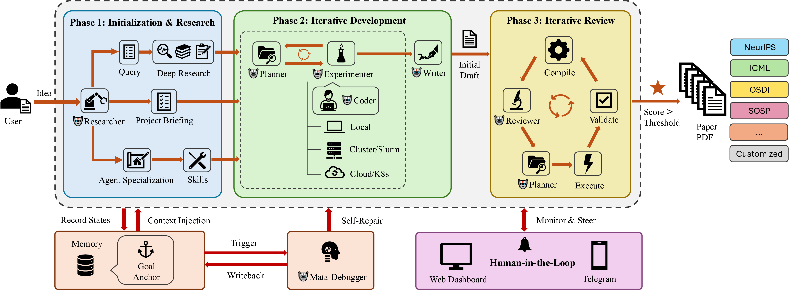

<p align="center">
  <a href="README.md">English</a> &bull; <strong>中文</strong> &bull; <a href="README_ar.md">العربية</a>
</p>

<p align="center">
  
</p>

<h1 align="center">ARK &mdash; 智能体研究工具包</h1>

<p align="center">
  <em>自动化苦活，不自动化方向。</em>
</p>

<p align="center">
  
  
  <a href="https://github.com/kaust-ark/ARK/actions/workflows/ci.yml"></a>
  
  
  
</p>

<p align="center">
  <a href="https://idea2paper.org/"><strong>网站</strong></a> &bull;
  <a href="#快速开始">快速开始</a> &bull;
  <a href="#ark-pipeline">Pipeline</a> &bull;
  <a href="#ark-agents">Agents</a> &bull;
  <a href="#云计算">云端</a> &bull;
  <a href="#命令行参考">命令行</a>
</p>

---

ARK 协调 **6 个专业 AI 智能体**，将研究想法转化为论文——提案分析、文献调研、Slurm 实验、LaTeX 撰写与迭代审稿——你随时通过 **CLI**、**Dashboard** 或 **Telegram** 掌控全局。

```
给它一个想法和目标会议，ARK 处理其余一切。
```

## ARK 撰写的论文

<table align="center">
<tr>
<td align="center" width="50%">
<a href="https://idea2paper.org/assets/papers/marco.pdf"></a>
<br>
<strong>MARCO: Budget-Constrained Multi-Modal Research Synthesis via Iterative-Deepening Agentic Search</strong>
<br>
<sub>模板：EuroMLSys</sub>
</td>
<td align="center" width="50%">
<a href="https://idea2paper.org/assets/papers/heteroserve.pdf"></a>
<br>
<strong>HeteroServe: Capability-Weighted Batch Scheduling for Heterogeneous GPU Clusters in LLM Inference</strong>
<br>
<sub>模板：ICML</sub>
</td>
</tr>
<tr>
<td align="center" width="50%">
<a href="https://idea2paper.org/assets/papers/tierkv.pdf"></a>
<br>
<strong>TierKV: Prefetch-Aware Memory Tiering for KV Cache in LLM Serving</strong>
<br>
<sub>模板：NeurIPS</sub>
</td>
<td align="center" width="50%">
<a href="https://idea2paper.org/assets/papers/gac.pdf"></a>
<br>
<strong>Why Smaller Is Slower: Dimensional Misalignment in Compressed Large Language Models</strong>
<br>
<sub>模板：ICLR</sub>
</td>
</tr>
</table>

---

## ARK 总体框架

<p align="center">
  
</p>

ARK 协调三大阶段 —— **初始化与调研**、**迭代开发**、**迭代审稿** —— 通过共享记忆、用于自修复的 Meta-Debugger，以及经由 Web Dashboard 或 Telegram 的人机协同进行引导。

---

## ARK Pipeline

ARK 按三个阶段依次执行。Review 阶段循环迭代直到论文达到目标分数。

<p align="center">
  
</p>

| 阶段 | 执行内容 |
|:------|:---------|
| **Research** | 5 步流水线：配置（conda 环境）&rarr; 分析提案（研究员）&rarr; Deep Research（Gemini）&rarr; 专项化（研究员）&rarr; 引导启动（skills &amp; 引用） |
| **Dev** | 迭代实验循环：规划 &rarr; Slurm 运行 &rarr; 分析 &rarr; 撰写初稿 |
| **Review** | 编译 &rarr; 审稿 &rarr; 规划 &rarr; 执行 &rarr; 验证，循环直到分数 &ge; 阈值 |

### Review 循环

每次 Review 迭代经过 **5 个步骤**：

<p align="center">
  
</p>

| 步骤 | 说明 |
|:-----|:-----|
| **Compile** | LaTeX &rarr; PDF，统计页数，提取页面图像 |
| **Review** | AI 审稿人评分 1&ndash;10，列出主要和次要问题 |
| **Plan** | 规划器生成优先级行动计划 |
| **Execute** | 研究员 + 实验者并行运行；写作者修改 LaTeX |
| **Validate** | 验证变更可编译，重新生成 PDF |

循环持续直到分数达到阈值——或你通过 Telegram 干预。

---

## ARK Agents

<p align="center">
  
</p>

| 智能体 | 职责 |
|:-------|:-----|
| **Researcher** | 分析提案 &rarr; 写入 `idea.md`；Gemini 文献综述；为项目定制智能体提示模板 |
| **Reviewer** | 按会议标准评分，生成改进任务 |
| **Planner** | 将审稿意见转化为优先级行动计划；分析开发阶段结果 |
| **Writer** | 撰写和打磨 LaTeX 章节，引用经 DBLP 验证 |
| **Experimenter** | 设计实验、提交 Slurm 任务、分析结果 |
| **Coder** | 编写和调试实验代码与分析脚本 |

---

## ARK 有何不同

| | 其他工具 | ARK |
|---|:---------|:----|
| **控制** | 全自动运行，偏离意图，无法中途纠偏 | 人机协同：关键决策暂停，Telegram 或网页随时介入 |
| **排版** | 布局混乱、LaTeX 报错、大量人工修复 | 硬编码 LaTeX + 会议模板（NeurIPS、ACL、IEEE……） |
| **引用** | LLM 编造看似合理但不存在的引用 | 每条引用经 DBLP API 验证，杜绝虚假文献 |
| **图表** | 默认样式、尺寸失控、无视页面约束 | Nano Banana + 会议画布尺寸、栏宽、字号精确匹配 |
| **隔离** | 共享环境，项目之间互相干扰 | 每项目独立 conda 环境、沙盒 HOME、完全多租户隔离 |
| **完整性** | LLM 模拟结果而非运行真实实验 | 反模拟提示 + 内置 Skills 强制真实执行 |

---

## 环境隔离

每个项目运行在独立的 **项目级 conda 环境** 中，在创建时从基础环境克隆。这确保了完全的多租户隔离：

- **沙盒 Python** &mdash; 每项目 `.env/` 目录，拥有独立的包
- **隔离 HOME** &mdash; 每个 orchestrator 以项目目录作为 HOME 运行
- **无交叉污染** &mdash; `PYTHONNOUSERSITE=1` 防止用户级包泄露
- **自动配置** &mdash; `ark run` 和 Web 门户自动检测并使用项目 conda 环境；流水线在缺失时自动引导创建

```bash
# conda 环境在首次运行时自动创建
# ark run 会检测并使用它：
ark run myproject
#   Conda env: /path/to/projects/myproject/.env
```

## Skills 系统

ARK 内置 **builtin skills** &mdash; 模块化指令集，智能体在运行时加载以强制执行最佳实践：

| Skill | 用途 |
|:------|:-----|
| **research-integrity** | 反模拟提示：智能体必须运行真实实验，不得伪造输出 |
| **human-intervention** | 升级协议：智能体在执行不可逆操作前通过 Telegram 暂停并请求确认 |
| **env-isolation** | 强制项目级环境边界 |
| **figure-integrity** | 验证图表内容与数据一致；防止占位或虚构的图表 |
| **page-adjustment** | 通过调整内容密度维持页数限制，而非删除章节 |

Skills 位于 `skills/builtin/`，在流水线引导阶段自动安装。

---

## 快速开始

```bash
# 安装
pip install -e .

# 创建项目（交互式向导）
ark new mma

# 运行——ARK 接管一切
ark run mma

# 实时监控
ark monitor mma

# 查看进度
ark status mma
```

向导将引导你完成：代码目录、目标会议、研究想法、作者、计算后端、图表生成和 Telegram 设置。

### 从现有 PDF 开始

```bash
ark new mma --from-pdf proposal.pdf
```

ARK 使用 PyMuPDF + Claude Haiku 解析 PDF，预填向导，从提取的规格启动项目。

---

## 命令行参考

| 命令 | 功能 |
|:-----|:-----|
| `ark new <name>` | 通过交互式向导创建项目 |
| `ark run <name>` | 启动 pipeline（自动检测项目级 conda 环境） |
| `ark status [name]` | 分数、迭代、阶段、成本 |
| `ark monitor <name>` | 实时仪表板：智能体活动、分数趋势 |
| `ark update <name>` | 注入运行中指令 |
| `ark stop <name>` | 优雅停止 |
| `ark restart <name>` | 停止并重启 |
| `ark research <name>` | 单独运行 Gemini Deep Research |
| `ark config <name> [key] [val]` | 查看或编辑配置 |
| `ark clear <name>` | 重置状态，重新开始 |
| `ark delete <name>` | 完全删除项目 |
| `ark setup-bot` | 配置 Telegram 机器人 |
| `ark list` | 列出所有项目及状态 |
| `ark webapp install` | 安装 Dashboard 服务 |
| `ark access list` | 查看 Cloudflare Access 访问允许列表 |
| `ark access add <email>` | 添加邮箱到 CF Access 允许列表 |
| `ark access remove <email>` | 从 CF Access 允许列表移除邮箱 |
| `ark access add-domain <domain>` | 添加邮箱域名规则到 CF Access |
| `ark access remove-domain <domain>` | 从 CF Access 移除邮箱域名规则 |

---

## Dashboard

ARK 提供基于 Web 的 Dashboard，用于管理项目、查看评分和控制智能体。Dashboard 展示 **实时阶段徽章**（Research / Dev / Review）、项目级 conda 环境状态和实时成本追踪。主页与 Dashboard 由同一个 FastAPI 服务托管——单端口、单 systemd 单元。

### 配置

Dashboard 通过 `webapp.env` 配置，位于 ARK 配置目录（默认：项目根目录下的 `.ark/webapp.env`）。首次运行 `ark webapp` 时自动创建。

#### 认证与访问
- **SMTP**：魔法链接登录所需。设置 `SMTP_HOST`、`SMTP_USER` 和 `SMTP_PASSWORD`。
- **访问限制**：使用 `ALLOWED_EMAILS`（指定用户）或 `EMAIL_DOMAINS`（整个组织）限制访问。
- **Google OAuth**：可选。设置 `GOOGLE_CLIENT_ID` 和 `GOOGLE_CLIENT_SECRET`。

### 管理命令

| 命令 | 描述 |
|:-----|:-----|
| `ark webapp` | 前台启动 Dashboard（适用于调试）。 |
| `ark webapp release` | 打 tag 并部署到生产环境工作树。 |
| `ark webapp install [--dev]` | 安装并启动为 `systemd` 用户服务。 |
| `ark webapp status` | 查看 systemd 服务状态。 |
| `ark webapp restart` | 重启 Dashboard 服务。 |
| `ark webapp logs [-f]` | 查看或追踪服务日志。 |

<details>
<summary><strong>服务详情（生产 vs. 开发）</strong></summary>

| | 生产环境 | 开发环境 |
|--|:---------|:---------|
| **端口** | 9527 | 1027 |
| **服务名** | `ark-webapp` | `ark-webapp-dev` |
| **Conda 环境** | `ark-prod` | `ark-dev` |
| **代码来源** | `~/.ark/prod/`（锁定版本） | 当前 repo（实时生效） |

</details>

<details>
<summary><strong>直接调用 orchestrator</strong></summary>

```bash
python -m ark.orchestrator --project mma --mode paper --max-iterations 20
python -m ark.orchestrator --project mma --mode dev
```

</details>

---

## Docker 使用

### 架构要求

> [!IMPORTANT]
> ARK 研究运行时依赖于在 x86_64 上最为稳定的科学计算库。如果你在 **Apple Silicon（M1/M2/M3）** Mac 上构建，必须为 `linux/amd64` 平台进行构建。
>
> 所有 ARK Dockerfile 及 `docker-compose.yml` 默认强制使用 `linux/amd64`。

### 使用 Docker Compose 运行

运行 ARK Web 门户最简便的方式是使用 `docker-compose`。在项目根目录执行：

```bash
# 启动 Web 门户（自动为 amd64 构建镜像）
docker compose -f docker/docker-compose.yml up --build -d
```

Web 门户将在 `http://localhost:9527` 上可访问。所有数据库、配置和项目数据均自动持久化到 Docker 命名卷（`ark_data`）中。

查看 Web 门户的实时日志：
```bash
docker compose -f docker/docker-compose.yml logs -f webapp
```

### 配置

自定义 Web 门户配置（例如，设置 SMTP 以支持魔法链接登录或 OAuth）：

```bash
# 创建自定义配置
cp .ark/webapp.env.example .ark/webapp.env
# 编辑 .ark/webapp.env，填入你的凭据
```
然后在 `docker/docker-compose.yml` 的 `webapp` 服务下取消注释环境卷映射：
```yaml
      - ../.ark/webapp.env:/data/.ark/webapp.env:ro
```

### 运行单独的 Job

你可以使用 ARK job 容器与 Web 应用一起运行隔离的研究 job。在 `docker/docker-compose.yml` 中取消注释 `job` 服务，然后运行：

```bash
docker compose -f docker/docker-compose.yml run --rm job \
  --project myproject \
  --project-dir /data/projects/<user-id>/myproject \
  --mode research \
  --iterations 10
```

*注意：必须通过环境变量传入所需的 API 密钥（如 `ANTHROPIC_API_KEY`、`GEMINI_API_KEY`）。*

### 直接运行独立容器

如果你不想使用 Docker Compose，也可以手动运行容器：

#### 1. 构建镜像（强制 amd64）
```bash
# 构建 Web 门户
docker build --platform linux/amd64 -f docker/Dockerfile.webapp -t ark-webapp .

# 构建 Job 容器
docker build --platform linux/amd64 -f docker/Dockerfile.job -t ark-job .
```

#### 2. 运行 Web 门户
```bash
docker run -d --name ark-webapp \
  --platform linux/amd64 \
  -p 9527:9527 \
  -v ark_data:/data \
  ark-webapp
```

#### 3. 运行研究 Job
```bash
docker run --rm -it \
  --platform linux/amd64 \
  -v ark_data:/data \
  -e ANTHROPIC_API_KEY="sk-ant-..." \
  ark-job \
  --project myproject \
  --project-dir /data/projects/myproject \
  --mode research
```

### 推送到 Google Cloud Platform（GCP）

ARK 提供脚本，用于构建镜像并推送到 Google Artifact Registry 或 GCR。

```bash
# 推送到 Artifact Registry（推荐）
./docker/push-gcp.sh --project [PROJECT_ID] --region [REGION] --repo [REPO] --build

# 推送到旧版 Container Registry（gcr.io）
./docker/push-gcp.sh --project [PROJECT_ID] --legacy --build
```
`--build` 标志会在 macOS 上自动为 `linux/amd64` 构建镜像。

---

## 云计算

ARK 支持在远程云虚拟机（AWS、GCP、Azure）上运行实验，同时将 orchestrator 和 Web 门户保持在**本地**运行。如果你希望获得弹性计算能力而无需管理 HPC 集群，这是推荐的部署方式。

**工作原理：**
1. Web 应用在本地或小型服务器上运行，负责项目管理和 UI。
2. 提交项目后，ARK 自动在云端创建虚拟机，通过 SSH 传输项目代码，并远程管理完整的实验生命周期。
3. 实验结果自动同步回本地。运行完成后虚拟机自动终止。

### 通过 Dashboard 启用云计算

1. 打开**设置**面板（顶部导航栏的 ⚙️ 图标）。
2. 向下滚动到**云计算**部分。
3. 输入你所选云服务商（AWS、GCP 或 Azure）的凭据。
4. 点击**保存**。此后所有项目提交将自动分发到云端。

> [!TIP]
> 云凭据使用你的 `SECRET_KEY` 进行静态加密。你的密钥不会被记录或传输给第三方。

### 配置层级

ARK 为云计算采用三层配置模型：
1. **系统默认值**：在 `webapp.env` 中设置（例如 `CLOUD_REGION`、`CLOUD_NETWORK`）。
2. **全局用户默认值**：在**设置**面板（⚙️）中设置。这些适用于你的所有项目。
3. **项目覆盖项**：在项目创建或重启期间设置。这些具有最高优先级。

这种层级结构允许你一次性定义标准的机器类型和 VPC 设置，同时能够为特定的高强度实验轻松切换到高性能 GPU 实例。

---

### 创建项目

配置好云计算后，推荐通过 Dashboard 启动项目：

1. 在 Dashboard 首页点击**新建项目**。
2. 填写研究目标、目标会议及其他补充说明。
3. 点击**提交** —— Web 应用会自动为项目生成 `config.yaml` 并创建云虚拟机。

生成的 `config.yaml` 存储在：

```
~/.ark/data/projects/<user_id>/<project_id>/config.yaml
```

你可以随时查看或手动编辑此文件（例如，调整实例类型或添加 `setup_commands`）。修改将在下次运行或重启时生效。

> [!NOTE]
> 如果在 `.ark/webapp.env` 中设置了 `PROJECTS_ROOT`，上述路径将替换为 `$PROJECTS_ROOT/<user_id>/<project_id>/config.yaml`。

---

### 云服务商配置

<details>
<summary><strong>☁️ Google Cloud Platform（GCP）</strong></summary>

#### 1. 创建服务账号

```bash
export PROJECT_ID=your-gcp-project-id

# 为 ARK 创建服务账号
gcloud iam service-accounts create ark-runner \
  --display-name="ARK Research Runner"

# 授予所需角色（Compute Admin + Service Account User）
gcloud projects add-iam-policy-binding $PROJECT_ID \
  --member="serviceAccount:ark-runner@${PROJECT_ID}.iam.gserviceaccount.com" \
  --role="roles/compute.admin"

gcloud projects add-iam-policy-binding $PROJECT_ID \
  --member="serviceAccount:ark-runner@${PROJECT_ID}.iam.gserviceaccount.com" \
  --role="roles/iam.serviceAccountUser"

# 下载 JSON 密钥
gcloud iam service-accounts keys create ~/ark-gcp-key.json \
  --iam-account=ark-runner@${PROJECT_ID}.iam.gserviceaccount.com
```

#### 2. 启用所需 API

```bash
gcloud services enable compute.googleapis.com --project=$PROJECT_ID
```

#### 3. 在 Dashboard 中配置

将 `~/ark-gcp-key.json` 的内容粘贴到设置面板的 **GCP 服务账号 JSON** 字段，并填写 **GCP 项目 ID**。

#### 4. `config.yaml` 参考（进阶 / 仅限 CLI）

Web 应用会根据你的设置自动生成此配置。对于手动或 CLI 驱动的项目，请在项目的 `config.yaml` 中添加以下内容：

```yaml
compute_backend:
  type: cloud
  provider: gcp
  region: us-central1-a          # 可用区，非区域
  instance_type: n1-standard-8
  image_id: common-cu121          # Deep Learning VM 镜像系列
  ssh_key_path: ~/.ssh/id_rsa
  ssh_user: user
  # 可选：GPU 加速器
  accelerator_type: nvidia-tesla-t4
  accelerator_count: 1
  # 可选：实例启动后执行的命令
  setup_commands:
    - conda activate base && pip install -r requirements.txt
```

</details>

---

<details>
<summary><strong>☁️ Amazon Web Services（AWS）</strong></summary>

#### 1. 创建 IAM 用户

```bash
# 为 ARK 创建 IAM 用户
aws iam create-user --user-name ark-runner

# 附加策略（EC2 完全访问权限即可）
aws iam attach-user-policy \
  --user-name ark-runner \
  --policy-arn arn:aws:iam::aws:policy/AmazonEC2FullAccess

# 创建访问密钥
aws iam create-access-key --user-name ark-runner
# 记录输出中的 AccessKeyId 和 SecretAccessKey
```

#### 2. 创建 SSH 密钥对

```bash
# 创建密钥对并保存到本地
aws ec2 create-key-pair \
  --key-name ark-key \
  --query 'KeyMaterial' \
  --output text > ~/.ssh/ark-key.pem
chmod 600 ~/.ssh/ark-key.pem
```

#### 3. 在 Dashboard 中配置

在设置面板中填写 **AWS Access Key ID**、**AWS Secret Access Key** 和 **AWS 区域**（如 `us-east-1`）。

#### 4. `config.yaml` 参考（进阶 / 仅限 CLI）

Web 应用会根据你的设置自动生成此配置。对于手动或 CLI 驱动的项目，请在项目的 `config.yaml` 中添加以下内容：

```yaml
compute_backend:
  type: cloud
  provider: aws
  region: us-east-1
  instance_type: g4dn.xlarge        # 1x T4 GPU，4 vCPU，16 GB RAM
  image_id: ami-0c7c51e8edb7b66d3   # Deep Learning AMI（Ubuntu 22.04）
  ssh_key_name: ark-key              # AWS 控制台中的密钥对名称
  ssh_key_path: ~/.ssh/ark-key.pem
  ssh_user: ubuntu
  security_group: sg-xxxxxxxx        # 必须允许入站 SSH（端口 22）
  # 可选：启动后配置命令
  setup_commands:
    - conda activate pytorch && pip install -r requirements.txt
```

> [!IMPORTANT]
> 确保你的安全组允许来自运行 Web 应用的机器 IP 的**入站 SSH（端口 22）**连接。否则 ARK 将无法连接到已创建的实例。

</details>

---

<details>
<summary><strong>☁️ Microsoft Azure</strong></summary>

#### 1. 创建服务主体

```bash
# 登录
az login

# 创建具有 Contributor 角色的服务主体
az ad sp create-for-rbac \
  --name "ark-runner" \
  --role Contributor \
  --scopes /subscriptions/YOUR_SUBSCRIPTION_ID
# 记录：appId（Client ID）、password（Client Secret）和 tenant（Tenant ID）
```

#### 2. 注册 SSH 公钥

```bash
# 如果还没有 SSH 密钥，请先生成
ssh-keygen -t rsa -b 4096 -f ~/.ssh/ark-azure-key

# 公钥（~/.ssh/ark-azure-key.pub）将自动被使用
```

#### 3. 在 Dashboard 中配置

在设置面板中填写 **Azure Client ID**、**Azure Client Secret**、**Azure Tenant ID** 和 **Azure Subscription ID**。

#### 4. `config.yaml` 参考（进阶 / 仅限 CLI）

Web 应用会根据你的设置自动生成此配置。对于手动或 CLI 驱动的项目，请在项目的 `config.yaml` 中添加以下内容：

```yaml
compute_backend:
  type: cloud
  provider: azure
  region: eastus                     # Azure 位置
  instance_type: Standard_NC6s_v3    # 1x V100 GPU，6 vCPU，112 GB RAM
  image_id: UbuntuLTS                # 操作系统镜像别名
  ssh_key_path: ~/.ssh/ark-azure-key
  ssh_user: azureuser
  resource_group: ark-resources      # 不存在时将自动创建
  # 可选：启动后配置命令
  setup_commands:
    - pip install -r requirements.txt
```

</details>

---

### 成本控制

> [!WARNING]
> 云虚拟机按小时计费。ARK 在每次运行完成后会自动终止实例。但如果 Web 应用进程被意外终止，**孤儿救援**机制将在下次重启时检测到遗留实例并将其标记为失败——但**不会自动终止云虚拟机**。每次意外关闭后，请务必在云控制台中确认没有遗留实例仍在运行。

---

## Telegram 集成

```bash
ark setup-bot    # 一次性配置：粘贴 BotFather token，自动检测 chat ID
```

功能：
- **富��本通知** &mdash; 格式化的分数变化、阶段转换、智能体活动和��误报告
- **发送指令** &mdash; 实时引导当前迭代方向
- **请求 PDF** &mdash; 获取最新编译论文
- **人工干预** &mdash; 智能体在执行不可逆操作前向你请求确认
- **HPC 友好** &mdash; 支持企业/HPC 网络的自签名 SSL ��书

---

## 环境要求

- **Python 3.9+** 及 `pyyaml`、`PyMuPDF`
- **智能体 CLI**：[Claude Code](https://docs.anthropic.com/en/docs/claude-code)（推荐，建议 Claude Max 订阅）**或** [Gemini CLI](https://github.com/google-gemini/gemini-cli) &mdash; 按项目选择
- 可选：LaTeX（`pdflatex` + `bibtex`）、Slurm、`google-genai`（AI 图表）

```bash
# 创建 conda 基础环境
conda env create -f environment.yml         # Linux (创建 "ark-base")
# 或者对于 macOS：
conda env create -f environment-macos.yml   # macOS (创建 "ark-base")

pip install -e .                    # 核心
pip install -e ".[research]"       # + Gemini Deep Research 和 Nano Banana
```

## 支持的会议模板

NeurIPS &bull; ICML &bull; ICLR &bull; AAAI &bull; ACL &bull; IEEE &bull; ACM SIGPLAN &bull; ACM SIGCONF &bull; LNCS &bull; MLSys &bull; USENIX &mdash; 另有 PLDI、ASPLOS、SOSP、EuroSys、OSDI、NSDI、INFOCOM 等别名。

## 许可证

[Apache 2.0](LICENSE)
